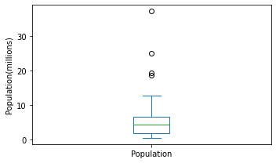
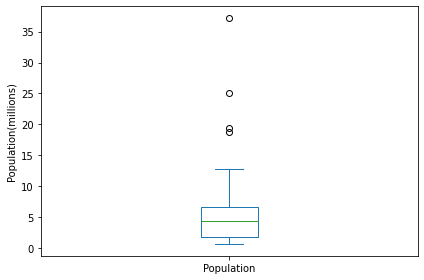
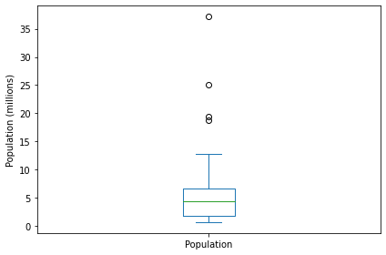

```python
%matplotlib inline

from pathlib import Path

import pandas as pd
import numpy as np
from scipy.stats import trim_mean
from statsmodels import robust
import wquantiles

import seaborn as sns
import matplotlib.pylab as plt
```


```python
pip install wquantiles
```

    Requirement already satisfied: wquantiles in /Users/rmbp/opt/anaconda3/lib/python3.7/site-packages (0.6)
    Requirement already satisfied: numpy>=1.18 in /Users/rmbp/opt/anaconda3/lib/python3.7/site-packages (from wquantiles) (1.21.2)
    Note: you may need to restart the kernel to use updated packages.


```python
try:
    import common
    DATA = common.dataDirectory()
except ImportError:
    DATA = Path().resolve() / 'data'
```


```python
PATH = '/Users/rmbp/desktop/practical-statistics-for-data-scientists/data/'
```


```python

AIRLINE_STATS_CSV = f'{PATH}airline_stats.csv'
KC_TAX_CSV = f'{PATH}kc_tax.csv.gz'
LC_LOANS_CSV = f'{PATH}lc_loans.csv'
AIRPORT_DELAYS_CSV = f'{PATH}dfw_airline.csv'
SP500_DATA_CSV = f'{PATH}sp500_data.csv.gz'
SP500_SECTORS_CSV = f'{PATH}sp500_sectors.csv'
STATE_CSV = f'{PATH}state.csv'
```


```python
# Table 1-2
state = pd.read_csv(STATE_CSV)
print(state.head(8))
```

             State  Population  Murder.Rate Abbreviation
    0      Alabama     4779736          5.7           AL
    1       Alaska      710231          5.6           AK
    2      Arizona     6392017          4.7           AZ
    3     Arkansas     2915918          5.6           AR
    4   California    37253956          4.4           CA
    5     Colorado     5029196          2.8           CO
    6  Connecticut     3574097          2.4           CT
    7     Delaware      897934          5.8           DE


```python
??pd.value_counts
```


```python
np.average(state['Murder.Rate'], weights=state.Population)
```


    4.445833981123393


```python
from scipy.stats import trim_mean
```


```python
trim_mean(state.Population, 0.10)
```


    4783697.125


```python
iqr = state.Population.quantile(0.75)-state.Population.quantile(0.25)
iqr
```


    4847308.0


```python
from statsmodels import robust
```


```python
?robust.scale.mad
```


```python
abs(state.Population - state.Population.median()).median()/ 0.6744897501960817
```


    3849876.1459979336


```python
state['Murder.Rate'].quantile([0.05,0.25,0.5,0.75,0.95])
```


    0.05    1.600
    0.25    2.425
    0.50    4.000
    0.75    5.550
    0.95    6.510
    Name: Murder.Rate, dtype: float64


```python
state['Murder.Rate'].quantile([0.05,0.25,0.5,0.75,0.95])
```


    0.05    1.600
    0.25    2.425
    0.50    4.000
    0.75    5.550
    0.95    6.510
    Name: Murder.Rate, dtype: float64


```python
percentile = [0.05,0.25,0.5,0.75,0.95]
df = pd.DataFrame(state['Murder.Rate'].quantile(percentile))
df.index = [f'{p * 100}%' for p in percentile]
df.T
```


<div>
<style scoped>
    .dataframe tbody tr th:only-of-type {
        vertical-align: middle;
    }

    .dataframe tbody tr th {
        vertical-align: top;
    }

    .dataframe thead th {
        text-align: right;
    }
</style>
<table border="1" class="dataframe">
  <thead>
    <tr style="text-align: right;">
      <th></th>
      <th>5.0%</th>
      <th>25.0%</th>
      <th>50.0%</th>
      <th>75.0%</th>
      <th>95.0%</th>
    </tr>
  </thead>
  <tbody>
    <tr>
      <th>Murder.Rate</th>
      <td>1.6</td>
      <td>2.425</td>
      <td>4.0</td>
      <td>5.55</td>
      <td>6.51</td>
    </tr>
  </tbody>
</table>
</div>


```python
import matplotlib.pylab as plt
ax = (state['Population']/1_000_000).plot.box(figsize=(5,3))
ax.set_ylabel('Population(millions)')
plt.tight_layout()
plt.show()
```


    

    


```python
import matplotlib.pylab as plt
ax = (state['Population']/1_000_000).plot.box()
ax.set_ylabel('Population(millions)')
plt.tight_layout()
plt.show()
```


    

    


```python
from matplotlib.pylab import plt
ax = (state['Population']/1_000_000).plot.box()
ax.set_ylabel('Population (millions)')
plt.tight_layout()
plt.show()
```


    

    


```python
populationbinned = pd.cut(state['Population'],10)
populationbinned.name = 'binnedpopulation'
df = pd.concat([state, populationbinned],axis = 1).sort_values('Population')
groups = []
for group, state in df.groupby('binnedpopulation'):
    groups.append({
        'BinRange' : group ,
        'Count' : len(state) ,
        'States' : ','.join(state.Abbreviation)
    })
print(pd.DataFrame(groups))    
    
```

                       BinRange  Count  \
    0    (526935.67, 4232659.0]     24   
    1    (4232659.0, 7901692.0]     14   
    2   (7901692.0, 11570725.0]      6   
    3  (11570725.0, 15239758.0]      2   
    4  (15239758.0, 18908791.0]      1   
    5  (18908791.0, 22577824.0]      1   
    6  (22577824.0, 26246857.0]      1   
    7  (26246857.0, 29915890.0]      0   
    8  (29915890.0, 33584923.0]      0   
    9  (33584923.0, 37253956.0]      1   
    
                                                                        States  
    0  WY,VT,ND,AK,SD,DE,MT,RI,NH,ME,HI,ID,NE,WV,NM,NV,UT,KS,AR,MS,IA,CT,OK,OR  
    1                                KY,LA,SC,AL,CO,MN,WI,MD,MO,TN,AZ,IN,MA,WA  
    2                                                        VA,NJ,NC,GA,MI,OH  
    3                                                                    PA,IL  
    4                                                                       FL  
    5                                                                       NY  
    6                                                                       TX  
    7                                                                           
    8                                                                           
    9                                                                       CA  


```python
for group, state in df.groupby('binnedpopulation'):
    print({1 : state.Population , 2: ','.join(state.State)})
```

    {1: 49     563626
    44     625741
    33     672591
    1      710231
    40     814180
    7      897934
    25     989415
    38    1052567
    28    1316470
    18    1328361
    10    1360301
    11    1567582
    26    1826341
    47    1852994
    30    2059179
    27    2700551
    43    2763885
    15    2853118
    3     2915918
    23    2967297
    14    3046355
    6     3574097
    35    3751351
    36    3831074
    Name: Population, dtype: int64, 2: 'Wyoming,Vermont,North Dakota,Alaska,South Dakota,Delaware,Montana,Rhode Island,New Hampshire,Maine,Hawaii,Idaho,Nebraska,West Virginia,New Mexico,Nevada,Utah,Kansas,Arkansas,Mississippi,Iowa,Connecticut,Oklahoma,Oregon'}
    {1: 16    4339367
    17    4533372
    39    4625364
    0     4779736
    5     5029196
    22    5303925
    48    5686986
    19    5773552
    24    5988927
    41    6346105
    2     6392017
    13    6483802
    20    6547629
    46    6724540
    Name: Population, dtype: int64, 2: 'Kentucky,Louisiana,South Carolina,Alabama,Colorado,Minnesota,Wisconsin,Maryland,Missouri,Tennessee,Arizona,Indiana,Massachusetts,Washington'}
    {1: 45     8001024
    29     8791894
    32     9535483
    9      9687653
    21     9883640
    34    11536504
    Name: Population, dtype: int64, 2: 'Virginia,New Jersey,North Carolina,Georgia,Michigan,Ohio'}
    {1: 37    12702379
    12    12830632
    Name: Population, dtype: int64, 2: 'Pennsylvania,Illinois'}
    {1: 8    18801310
    Name: Population, dtype: int64, 2: 'Florida'}
    {1: 31    19378102
    Name: Population, dtype: int64, 2: 'New York'}
    {1: 42    25145561
    Name: Population, dtype: int64, 2: 'Texas'}
    {1: Series([], Name: Population, dtype: int64), 2: ''}
    {1: Series([], Name: Population, dtype: int64), 2: ''}
    {1: 4    37253956
    Name: Population, dtype: int64, 2: 'California'}


```python

```


```python

```


```python

```


```python

```
